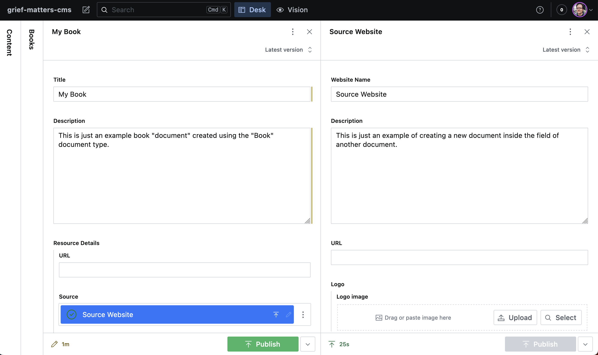
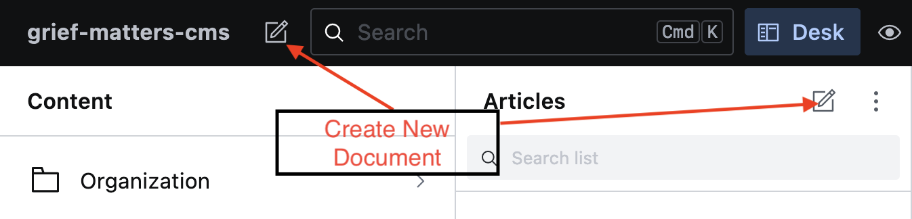
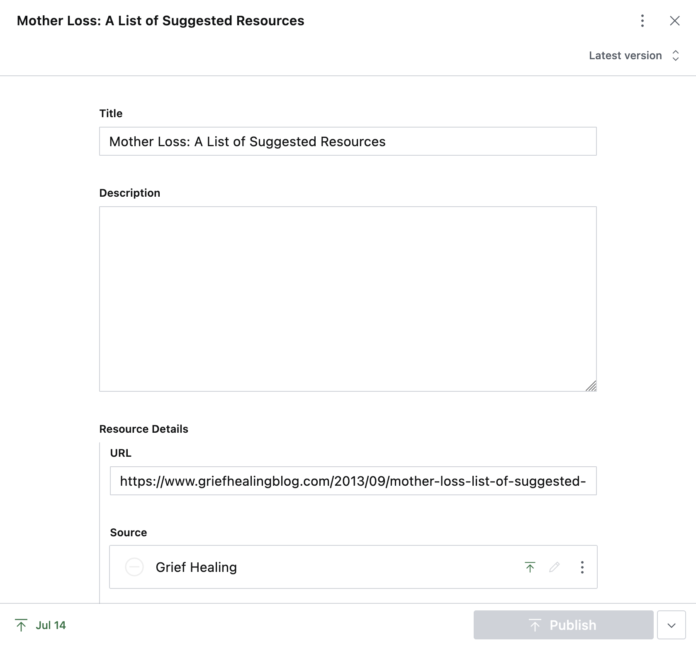
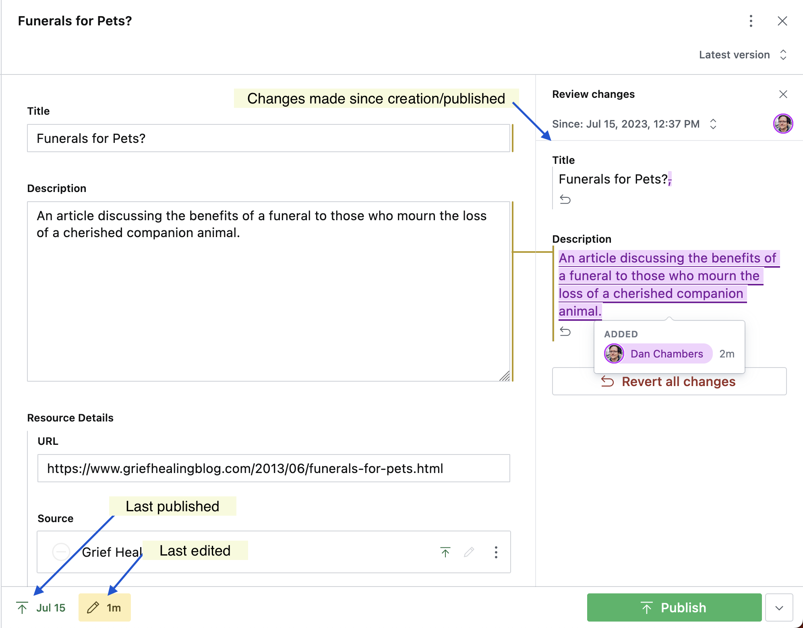
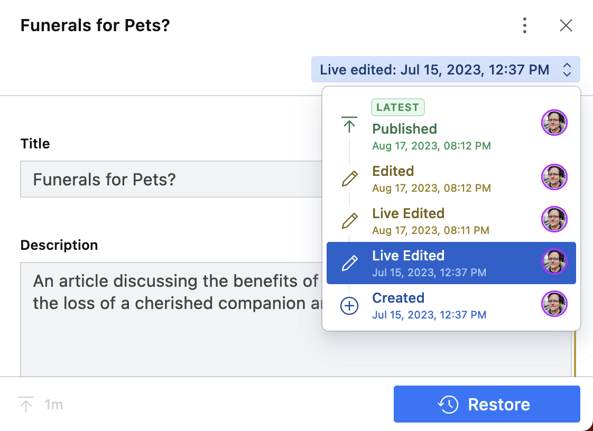
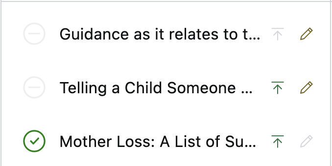
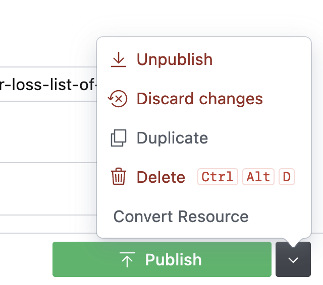
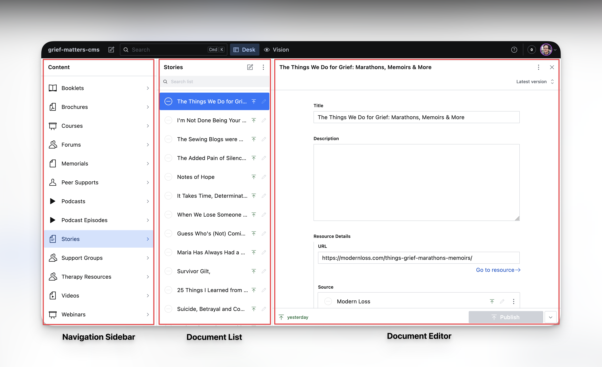
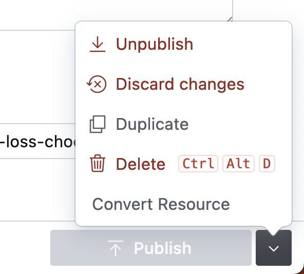

<!-- # Why Grief Matters Content Management System (CMS)

## Getting Started (Content Editors)

The Sanity CMS has a simple, intuitive, customizable interface that we can tailor to our needs.

### Quick Start

In Sanity, each piece of content is called a **"document"**. The types of content listed in the left-most column such as "Articles" and "Books" are our **"document types"**. A "document type" is essentially a template that allows us to create pieces of content that conform to a specific shape. For example, our "Book" document type has an "ISBN" field and an "Author" field but our "Website" document type does not.

A document type can even use other document types as part of its definition, or even reference other documents.

This technique allows us to create relationships between different documents. The best example of this is with our "Category" type. Not only do all of out resource document types have a "Categories" field to which one or more "category" documents can be assigned, but also, each "category" itself can have "Child Categories".

### Interface Overview

This is the Sanity Studio interface:

The left hand column entitled **Content** is where all of our content resides.

When we select a document type in the left-hand column, the center column will be populated with all of the documents that we have created using that document type.

When we select a document from the list, the document editing pane will show over on the right.

Occasionally you will be able to create further documents of a specific type inside of another document.

In the example above, we're creating a new "Website" document from the "Source" field of a "Book" document. Once created, the "Website" document will be available in the same way as if you were to create a "Website" document from scratch.

You may also notice that because we have to document panes open at once, the other columns have collapsed. If you need to focus on a single column you activate this collapsing of columns manually by clicking the heading of the column you want to minimize.

## Creating Documents

To create a document select the 'New document' button from either the top left of the interface (this will let you pick the document type you wish to create) or the 'New Document' button at the top of a document list. That button will create a document of that specific type.

Your document will initially be saved as a "draft" indicated by a yellow pencil icon in the bottom-left of the document editing pane. Changes in Sanity are saved constantly - so you can leave and come back to the document if you're not finished with your changes.

When you are ready for your document to be published to the website - you simply select "Publish" down on the bottom right.

## Document Editing

When you create a new document or select an existing one you will be presented with the document editing pane:

When you start editing your document the changes made since it was created or last published will be tracked. Information is also available at the bottom for when the document was last published and how long since the last changes were made. To review any changes - you can click the pencil icon and they will be shown over on the right hand side. This additional menu let's you review (and revert) any changes made since the document was last published.

We can even restore to an earlier version of a document by selecting the version menu in the top-right of the document pane, we can preview previous versions by selecting them from the menu and we can restore to a specific version by selecting "Restore".

## Document List

The document list shows us all of our documents for a given type.

For convenience, there are a number of icons that indicate the status of a document.

If the document is one of our internet resource types there will be a status icon to the left of the document title. Documents with this icon will contain a toggle with the label **Resource has been checked for errors**.

This is a temporary feature that we need whilst we sanitize the resources imported automatically from the original Word document version of the guide.

Documents that have been checked and validated will show a green checked circle icon.

To the right of the title are the "Published" (up arrow icon) and "Edited" (pencil icon) icons.

The published icon describes whether a document has been published. It is green when a document is published, and grey when it is unpublished. A document will only show on the website when it has been published in the CMS.

The edited icon describes whether the document currently has unpublished changes.

**_IMPORTANT: Sanity saves all changes on the fly. This means you can make many changes to many documents leaving them in a "draft" like state. Your changes will not be "live" until you have published._**

Once we have made changes to our document we will see that the "Publish" button turns green. Any changes we make to a document are saved, but they will not be reflected on our website until they have been "published". This means that we can work on changes to content without affecting the live website.

To the right of the publish button there is a menu that gives us a number of options depending on the state of the document.

### Publish/Unpublish

Publishing a document will mark the document and any saved changes as ready for publishing to our website. Unpublish will mark the document as not ready. Unpublished documents will not be visible on the website.

### Discard Changes

When a document has saved changes but those changes have not yet been published (indicated by a yellow pencil icon in the document list) - then the changes can be discarded - and the document will revert to its last published version.

### Duplicate

DO NOT USE - This button is to be removed!!! We should not have duplicate resources within the CMS!!!

### Delete

This will delete a document from the CMS - use with care.

### Convert Resource

This will allow you to convert certain document types from one type to another - this will help where resources have been created as one type but are later identified as being another.

**_IMPORTANT: Some information may be lost during the conversion process - such as if you convert a 'Book' to an 'Article' - the ISBN and Author fields will be removed_**

# Why Grief Matters Sanity Studio User Guide

Sanity Studio has a simple, intuitive, interface built specifically for our needs.

This user guide aims to take you from zero-knowledge of Sanity Studio to creating and editing content in the shortest possible time.

We have a **"sandbox"** environment available so you can get accustomed to Sanity without affecting live data. Log in using your usual Sanity account at: [https://sanbox--grief-matters-cms.netlify.com](https://sanbox--grief-matters-cms.netlify.com)

Before we jump in to Sanity Studio there is some terminology to be familiar with.

### Documents

In Sanity Studio, a document refers to a piece of content like an article, image, or product. It's a structured unit of data with fields that hold information such as text, images, and dates. Documents are the building blocks managed in Sanity Studio's content system, allowing for flexible customization to fit specific project needs.

### Document Types

A "document type" in Sanity Studio is a blueprint for creating specific types of content. It defines the structure and fields that a document of that type can have. For instance, a "Story" document type includes fields for title, description, photograph etc. Document types provide consistency and organization to the content creation process, ensuring that each piece of content follows a predefined format.

### References

In Sanity Studio, "references" are connections between different documents. They allow us to link one document to another, creating relationships between pieces of content. For example, you can reference a "website" document within an "article" document to attribute its "source". These references enhance content management and enable dynamic updates, as changes to a referenced document automatically reflect in all connected instances.

## Sanity Studio Interface

The screenshot below shows the Sanity Studio interface:

#### Navigation Sidebar

Located on the left side of the screen, the navigation sidebar provides quick access to different sections of Sanity Studio. It typically includes links to various document types, tools, and settings.

#### Document List

The central area of the interface displays a list of documents based on the selected document type. Each entry in the list showcases key information, such as titles or preview images, allowing easy identification and selection.

#### Document Editor

When you select a specific document from the list, the document editor appears. It's here that you can view and edit the content within the chosen document type. The editor displays fields and their corresponding data, enabling you to make changes and updates.

When you access a **reference** on a document (i.e. a linked **document**). A second **document editor** will open so that you can conveniently edit the referenced document without navigating away.

When two document editors are open, the left panels automatically collapse. Clicking on the collapsed panels reveals them; this collapses one document editor and vice versa. Panes might also collapse when browser space is limited, but a single click expands them for viewing.

## Creating Documents

To follow along with this guide log in to the **"sandbox"** at [https://sanbox--grief-matters-cms.netlify.com](https://sanbox--grief-matters-cms.netlify.com).

Let's create our first document by adding a "story"

In Sanity Studio you can create a new document in one of two ways:

1. Select the document type you want to create in the navigation sidebar. Then select the **New Document** button at the top of the document list.
2. Select the "New Document" button in the header, and select the type of document you want to create.

 -->

# Why Grief Matter Content Management System

This guide will help you get started using the **Why Grief Matters Content Management System (CMS)**. The CMS is an implementation of [Sanity Studio](https://www.sanity.io/studio).

Sanity is a modern headless CMS (Content Management System). Sanity uses structured content to endlessly re-use content across any channel and a composable approach to help businesses connect to any third-party technology, data source, and front end framework.

Before we jump in to Sanity Studio there is some terminology to be familiar with.

#### Documents

In Sanity Studio, a document refers to a piece of content like an article, image, or product. It's a structured unit of data with fields that hold information such as text, images, and dates. Documents are the building blocks managed in Sanity Studio's content system, allowing for flexible customization to fit specific project needs.

#### Document Types

A "document type" in Sanity Studio is a blueprint for creating specific types of content. It defines the structure and fields that a document of that type can have. For instance, a "Story" document type includes fields for title, description, photograph etc. Document types provide consistency and organization to the content creation process, ensuring that each piece of content follows a predefined format.

#### References

In Sanity Studio, "references" are connections between different documents. They allow us to link one document to another, creating relationships between pieces of content. For example, you can reference a "website" document within an "article" document to attribute its "source". These references enhance content management and enable dynamic updates, as changes to a referenced document automatically reflect in all connected instances.

## Sanity Studio Interface

The screenshot below shows the Sanity Studio interface:

#### Navigation Sidebar

Located on the left side of the screen, the navigation sidebar provides quick access to different sections of Sanity Studio. It typically includes links to various document types, tools, and settings.

#### Document List

The central area of the interface displays a list of documents based on the selected document type. Each entry in the list showcases key information, such as titles or preview images, allowing easy identification and selection.

#### Document Editor

When you select a specific document from the list, the document editor appears. It's here that you can view and edit the content within the chosen document type. The editor displays fields and their corresponding data, enabling you to make changes and updates.

## Creating Documents

To follow along with this guide log in to the **"sandbox"** at [https://sandbox--grief-matters-sanity-studio.netlify.com](https://sandbox--grief-matters-sanity-studio.netlify.com).

Let's create our first document by adding a "story"

In Sanity Studio you can create a new document in one of two ways:

You can either, select the document type you want to create in the navigation sidebar. Then select the **New Document** button at the top of the document list (_see #1 in the screenshot below_).

Or, select the "New Document" button in the header, and select the type of document you want to create (_see #2 in the screenshot below_).

You'll be presented with an empty document editor as below:

The screenshot below shows a few pointers on what the various elements mean:

When you create a new document directly from a **reference field**. A second **document editor** will open so that you can conveniently create the referenced document without navigating away.

When two document editors are open, the left panels automatically collapse. Clicking on the collapsed panels reveals them; this collapses one document editor and vice versa. Panes might also collapse when browser space is limited, but a single click expands them for viewing.

Reference fields are **dependent** on the documents they reference, as such you will not be able to publish a document with a reference field unless the document it references is also published.

When you first create a document it will be created as a **draft** and will not show on our website until it has been **published**. The various document states are discussed in the nest section.

## Document States

Documents in Sanity can be in various states depending on what stage of the content editing lifecycle they are at.

#### Draft

When a document is first created it will be in the **draft** state. A document that is in **draft** does not yet show on our website until it is published. All changes are saved automatically so a document can go through several revisions before it is published.

A document will also move to **draft** when changes have been made to a **published** document. The previously published version will remain visible on our website until the draft changes have been reviewed and published.

#### Ready for Review

A document in **draft** must be marked as **ready for review** once the changes are ready to publish. This toggle is only available on new draft documents or previously published documents with changes.

#### Published

Documents that have been marked as **ready for review** are then able to be **published**. This provides an extra step of protection to ensure that changes are approved before being published to the website.

Only authorized Sanity accounts are able to publish documents.

## Editing Documents

To get to an existing document to make edits there are two options. Either select the relevant type in the navigation sidebar, then select the document from the list (or search the list using the document list search), or using the header search bar you can search by title or any other attribute of a document to find what you are looking for.

Making changes is exactly the same as creating a new document. Just edit the fields you need to change and a new draft will be created. Previously published documents will remain the same until the draft changes are published much the same as a new document.

## Document Revisions

You can view and restore previous versions of a document. You can see the version you are currently viewing in the upper-right of the document editor.

By clicking the current document version you can inspect previous versions as well as restore to a previous version.

Just above this control, the ellipsis will also allow you to review changes between versions to give a better impression of how a document has changed over time.

## Document Actions

In the bottom right of the document editor there are a number of **document actions** available based on the state or type of the current document. You may see some or all of these options in specific scenarios.

**1. Unpublish:** allows you to unpublish a document - this will remove it from the next build of the Grief Matters website.

**2. Discard Changes:** allows you to discard any changes made since the last published version of the document (in essence, deleting the current draft)

**3. Duplicate:** [[TODO - any control over the output?]]

**4. Delete:** this will delete the current document.

**5. Convert Resource:** will allow you to convert certain document types from one type to another - this will help where resources have been created as one type but are later identified as being another.

**_IMPORTANT: Some information may be lost during the conversion process - such as if you convert a 'Book' to an 'Article' - the ISBN and Author fields will be removed_**